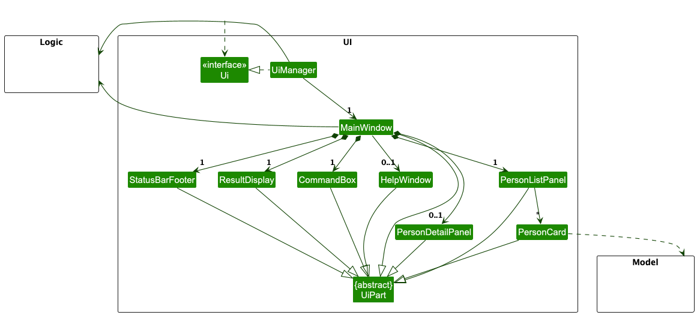
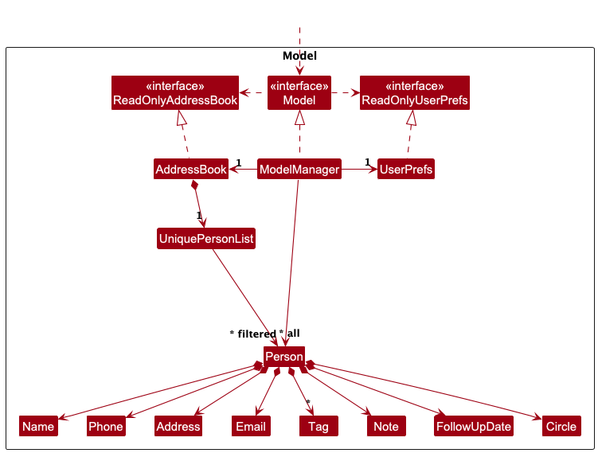
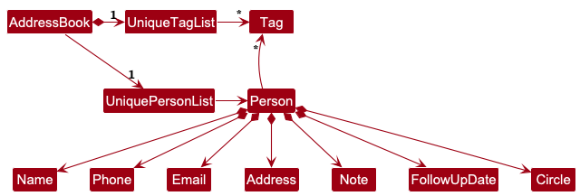
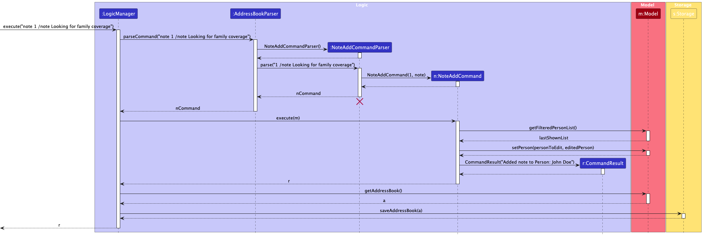
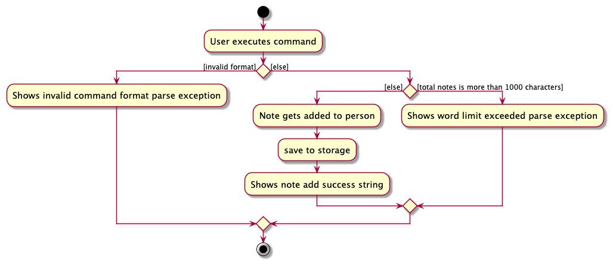

* Table of Contents
{:toc}

--------------------------------------------------------------------------------------------------------------------

## **Acknowledgements**

This project is based on the [AddressBook-Level3](https://github.com/se-edu/addressbook-level3) project created by the [SE-EDU initiative](https://se-education.org).

--------------------------------------------------------------------------------------------------------------------

## **Setting up, getting started**

Refer to the guide [_Setting up and getting started_](SettingUp.md).

--------------------------------------------------------------------------------------------------------------------

## **Design**

:bulb: **Tip:** The `.puml` files used to create diagrams are in this document `docs/diagrams` folder. Refer to the [_PlantUML Tutorial_ at se-edu/guides](https://se-education.org/guides/tutorials/plantUml.html) to learn how to create and edit diagrams.

### Architecture

The ***Architecture Diagram*** given above explains the high-level design of the App.

Given below is a quick overview of main components and how they interact with each other.

**Main components of the architecture**

**`Main`** (consisting of classes [`Main`](https://github.com/AY2526S2-CS2103T-W12-4/tp/blob/master/src/main/java/seedu/address/Main.java) and [`MainApp`](https://github.com/AY2526S2-CS2103T-W12-4/tp/blob/master/src/main/java/seedu/address/MainApp.java)) is in charge of the app launch and shut down.
* At app launch, it initializes the other components in the correct sequence, and connects them up with each other.
* At shut down, it shuts down the other components and invokes cleanup methods where necessary.

The bulk of the app's work is done by the following four components:

* [**`UI`**](#ui-component): The UI of the App.
* [**`Logic`**](#logic-component): The command executor.
* [**`Model`**](#model-component): Holds the data of the App in memory.
* [**`Storage`**](#storage-component): Reads data from, and writes data to, the hard disk.

[**`Commons`**](#common-classes) represents a collection of classes used by multiple other components.

**How the architecture components interact with each other**

The *Sequence Diagram* below shows how the components interact with each other for the scenario where the user issues the command `delete 1`.

Each of the four main components (also shown in the diagram above),

* defines its *API* in an `interface` with the same name as the Component.
* implements its functionality using a concrete `{Component Name}Manager` class (which follows the corresponding API `interface` mentioned in the previous point.)

For example, the `Logic` component defines its API in the `Logic.java` interface and implements its functionality using the `LogicManager.java` class which follows the `Logic` interface. Other components interact with a given component through its interface rather than the concrete class (reason: to prevent outside components being coupled to the implementation of a component), as illustrated in the (partial) class diagram below.

The sections below give more details of each component.

### UI component

The **API** of this component is specified in [`Ui.java`](https://github.com/AY2526S2-CS2103T-W12-4/tp/blob/master/src/main/java/seedu/address/ui/Ui.java)

The UI consists of a `MainWindow` that is made up of parts e.g.`CommandBox`, `ResultDisplay`, `PersonListPanel`, `StatusBarFooter` etc. All these, including the `MainWindow`, inherit from the abstract `UiPart` class which captures the commonalities between classes that represent parts of the visible GUI.

The `UI` component uses the JavaFx UI framework. The layout of these UI parts are defined in matching `.fxml` files that are in the `src/main/resources/view` folder. For example, the layout of the [`MainWindow`](https://github.com/AY2526S2-CS2103T-W12-4/tp/blob/master/src/main/java/seedu/address/ui/MainWindow.java) is specified in [`MainWindow.fxml`](https://github.com/AY2526S2-CS2103T-W12-4/tp/blob/master/src/main/resources/view/MainWindow.fxml)

The `UI` component,

* executes user commands using the `Logic` component.
* listens for changes to `Model` data so that the UI can be updated with the modified data.
* keeps a reference to the `Logic` component, because the `UI` relies on the `Logic` to execute commands.
* depends on some classes in the `Model` component, as it displays `Person` object residing in the `Model`.
* manages **View Mode**, a UI state where full contact details are displayed. Refer to the
[View feature](#view-feature) section for implementation details.

### Logic component

**API** : [`Logic.java`](https://github.com/AY2526S2-CS2103T-W12-4/tp/blob/master/src/main/java/seedu/address/logic/Logic.java)

Here's a (partial) class diagram of the `Logic` component:

The sequence diagram below illustrates the interactions within the `Logic` component, taking `execute("delete 1")` API call as an example.

:information_source: **Note:** The lifeline for `DeleteCommandParser` should end at the destroy marker (X) but due to a limitation of PlantUML, the lifeline continues till the end of diagram.

How the `Logic` component works:

1. When `Logic` is called upon to execute a command, it is passed to an `AddressBookParser` object which in turn creates a parser that matches the command (e.g., `DeleteCommandParser`) and uses it to parse the command.
1. This results in a `Command` object (more precisely, an object of one of its subclasses e.g., `DeleteCommand`) which is executed by the `LogicManager`.
1. The command can communicate with the `Model` when it is executed (e.g. to delete a person). 
   Note that although this is shown as a single step in the diagram above (for simplicity), in the code it can take several interactions (between the command object and the `Model`) to achieve.
1. The result of the command execution is encapsulated as a `CommandResult` object which is returned back from `Logic`.

Here are the other classes in `Logic` (omitted from the class diagram above) that are used for parsing a user command:

How the parsing works:
* When called upon to parse a user command, the `AddressBookParser` class creates an `XYZCommandParser` (`XYZ` is a placeholder for the specific command name e.g., `AddCommandParser`) which uses the other classes shown above to parse the user command and create a `XYZCommand` object (e.g., `AddCommand`) which the `AddressBookParser` returns back as a `Command` object.
* All `XYZCommandParser` classes (e.g., `AddCommandParser`, `DeleteCommandParser`, ...) inherit from the `Parser` interface so that they can be treated similarly where possible e.g, during testing.

### Model component
**API** : [`Model.java`](https://github.com/AY2526S2-CS2103T-W12-4/tp/blob/master/src/main/java/seedu/address/model/Model.java)

The `Model` component,

* stores the address book data i.e., all `Person` objects (which are contained in a `UniquePersonList` object). Each `Person` stores core contact details such as `Name`, `Phone`, `Address`, and `Email`, together with additional fields such as `Tag`, `Note`, `FollowUpDate`, and `Circle`.
* stores the currently 'selected' `Person` objects (e.g., results of a search query) as a separate _filtered_ list which is exposed to outsiders as an unmodifiable `ObservableList<Person>` that can be 'observed'; for example, the UI can be bound to this list so that it automatically updates when the data in the list changes.
* stores a `UserPref` object that represents the user’s preferences. This is exposed to the outside as a `ReadOnlyUserPref` object.
* does not depend on any of the other three components, as the `Model` represents data entities of the domain and should make sense on its own without depending on the other components.

:information_source: **Note:** An alternative (arguably, a more OOP) model is given below. It keeps a `Tag` list in the `AddressBook`, which each `Person` references. This allows the `AddressBook` to maintain a single `Tag` object for each unique tag, instead of each `Person` storing separate `Tag` objects. In our current implementation, a `Person` may also store additional fields such as `Note`, `FollowUpDate`, and `Circle`. 

### Storage component

**API** : [`Storage.java`](https://github.com/AY2526S2-CS2103T-W12-4/tp/blob/master/src/main/java/seedu/address/storage/Storage.java)

The `Storage` component,
* can save both address book data and user preference data in JSON format, and read them back into corresponding objects.
* inherits from both `AddressBookStorage` and `UserPrefStorage`, which means it can be treated as either one (if only the functionality of only one is needed).
* depends on some classes in the `Model` component (because the `Storage` component's job is to save/retrieve objects that belong to the `Model`)

### Common classes

Classes used by multiple components are in the `seedu.address.commons` package.

--------------------------------------------------------------------------------------------------------------------

## **Implementation**

This section describes some noteworthy details on how certain features are implemented.

### Note Add feature
#### The sequence diagram

The following sequence diagram shows how a `NoteAddCommand` is executed through the `Logic` component:

The following activity diagram summarizes the execution of a `NoteAddCommand`:

### Tag Add feature

Users can add tags to contacts for categorisation, using the `tagadd` command. The implementation of this feature is shown in the sequence diagram below.

#### The sequence diagram

:information_source: **Note:** The lifeline for `TagAddCommandParser` should end at the destroy marker (X) but due to a limitation of PlantUML, the lifeline continues till the end of diagram.

### View feature

Users can view the full details of a contact using the `view` command. The implementation of this feature is shown
in the sequence diagram below.

#### The sequence diagram

:information_source: **Note:** The lifeline for `ViewCommandParser`
should end at the destroy marker (X) but due to a limitation of PlantUML, the lifeline continues till the end of diagram.

After `ViewCommand` executes, the app enters **View Mode**. `MainWindow` sets `isInViewMode = true` and 
calls `handleViewPerson()` to display the contact's full details. While in View Mode, the contact is always shown at index 1. Running `add`, `list`, `delete`, `clear`, `find`, or `remind` exits View Mode and clears the detail panel. All other commands (e.g. `edit`, `note`, `followup`) keep the app in View Mode and refresh the detail panel with the latest contact details.

### \[Proposed\] Undo/redo feature

#### Proposed Implementation

The proposed undo/redo mechanism is facilitated by `VersionedAddressBook`. It extends `AddressBook` with an undo/redo history, stored internally as an `addressBookStateList` and `currentStatePointer`. Additionally, it implements the following operations:

* `VersionedAddressBook#commit()` — Saves the current address book state in its history.
* `VersionedAddressBook#undo()` — Restores the previous address book state from its history.
* `VersionedAddressBook#redo()` — Restores a previously undone address book state from its history.

These operations are exposed in the `Model` interface as `Model#commitAddressBook()`, `Model#undoAddressBook()` and `Model#redoAddressBook()` respectively.

Given below is an example usage scenario and how the undo/redo mechanism behaves at each step.

Step 1. The user launches the application for the first time. The `VersionedAddressBook` will be initialized with the initial address book state, and the `currentStatePointer` pointing to that single address book state.

Step 2. The user executes `delete 5` command to delete the 5th person in the address book. The `delete` command calls `Model#commitAddressBook()`, causing the modified state of the address book after the `delete 5` command executes to be saved in the `addressBookStateList`, and the `currentStatePointer` is shifted to the newly inserted address book state.

Step 3. The user executes `add n/David …​` to add a new person. The `add` command also calls `Model#commitAddressBook()`, causing another modified address book state to be saved into the `addressBookStateList`.

:information_source: **Note:** If a command fails its execution, it will not call `Model#commitAddressBook()`, so the address book state will not be saved into the `addressBookStateList`.

Step 4. The user now decides that adding the person was a mistake, and decides to undo that action by executing the `undo` command. The `undo` command will call `Model#undoAddressBook()`, which will shift the `currentStatePointer` once to the left, pointing it to the previous address book state, and restores the address book to that state.

:information_source: **Note:** If the `currentStatePointer` is at index 0, pointing to the initial AddressBook state, then there are no previous AddressBook states to restore. The `undo` command uses `Model#canUndoAddressBook()` to check if this is the case. If so, it will return an error to the user rather
than attempting to perform the undo.

The following sequence diagram shows how an undo operation goes through the `Logic` component:

:information_source: **Note:** The lifeline for `UndoCommand` should end at the destroy marker (X) but due to a limitation of PlantUML, the lifeline reaches the end of diagram.

Similarly, how an undo operation goes through the `Model` component is shown below:

The `redo` command does the opposite — it calls `Model#redoAddressBook()`, which shifts the `currentStatePointer` once to the right, pointing to the previously undone state, and restores the address book to that state.

:information_source: **Note:** If the `currentStatePointer` is at index `addressBookStateList.size() - 1`, pointing to the latest address book state, then there are no undone AddressBook states to restore. The `redo` command uses `Model#canRedoAddressBook()` to check if this is the case. If so, it will return an error to the user rather than attempting to perform the redo.

Step 5. The user then decides to execute the command `list`. Commands that do not modify the address book, such as `list`, will usually not call `Model#commitAddressBook()`, `Model#undoAddressBook()` or `Model#redoAddressBook()`. Thus, the `addressBookStateList` remains unchanged.

Step 6. The user executes `clear`, which calls `Model#commitAddressBook()`. Since the `currentStatePointer` is not pointing at the end of the `addressBookStateList`, all address book states after the `currentStatePointer` will be purged. Reason: It no longer makes sense to redo the `add n/David …​` command. This is the behavior that most modern desktop applications follow.

The following activity diagram summarizes what happens when a user executes a new command:

#### Design considerations:

**Aspect: How undo & redo executes:**

* **Alternative 1 (current choice):** Saves the entire address book.
  * Pros: Easy to implement.
  * Cons: May have performance issues in terms of memory usage.

* **Alternative 2:** Individual command knows how to undo/redo by
  itself.
  * Pros: Will use less memory (e.g. for `delete`, just save the person being deleted).
  * Cons: We must ensure that the implementation of each individual command are correct.

--------------------------------------------------------------------------------------------------------------------

## **Documentation, logging, testing, configuration, dev-ops**

* [Documentation guide](Documentation.md)
* [Testing guide](Testing.md)
* [Logging guide](Logging.md)
* [Configuration guide](Configuration.md)
* [DevOps guide](DevOps.md)

--------------------------------------------------------------------------------------------------------------------

## **Appendix: Requirements**

### Product scope

**Target user profile**:

**Primary target user**: _Student financial advisor_ who meets many people and needs to capture or retrieve contact info quickly.

* maintains a growing network
* often multitasking
* prefers fast keyboard commands
* can type fast
* prefers typing to mouse interactions
* is reasonably comfortable using CLI apps
* wants safe deletion to avoid accidental loss

**Value proposition**: FAM helps student financial advisors maintain and retrieve contacts quickly via keyboard-first commands, so they can follow up and manage relationships without relying on messy notes or slow UI workflows.

---

### User stories

Priorities: High (must have) - `* * *`, Medium (nice to have) - `* *`, Low (unlikely to have) - `*`

| Priority | As a …​                   | I want to …​                              | So that I can…​                                        |
|----------|---------------------------|-------------------------------------------|--------------------------------------------------------|
| `* * *`  | student financial advisor | add a contact                             | capture someone immediately after meeting them         |
| `* * *`  | student financial advisor | list all contacts                         | browse my network quickly                              |
| `* * *`  | student financial advisor | view a contact by index                   | open full details quickly after listing/searching      |
| `* * *`  | student financial advisor | find contacts by name keyword             | retrieve people instantly                              |
| `* * *`  | student financial advisor | edit a contact’s details                  | keep details accurate and fix typos quickly            |
| `* * *`  | student financial advisor | delete a contact with confirmation        | remove outdated entries safely                         |
| `* * *`  | student financial advisor | add a tag to a contact                    | categorise contacts quickly                            |
| `* * *`  | student financial advisor | remove a tag from a contact               | keep tags clean and updated                            |
| `* * *`  | student financial advisor | add notes on a contact                    | easily remember details about them                     |
| `* * *`  | student financial advisor | remove notes on a contact                 | keep notes clean and updated                           |
| `* * *`  | student financial advisor | add which circle an individual belongs to | easily classify my professional relationship with them |
| `* * *`  | student financial advisor | add a follow up date                      | see who I have met and are going to meet               |
| `* * *`  | student financial advisor | see who I have upcoming follow ups with   | see who I am supposed to meet up soon                  |
| `* *`    | student financial advisor | find contacts by notes keyword            | locate someone by remembered context                   |
| `* *`    | student financial advisor | list contacts filtered by tag             | target a group easily                                  |
| `* *`    | student financial advisor | sort contacts by name                     | scan large lists more easily                           |
| `* *`    | user                      | see usage instructions/help               | refer to commands when I forget how to use the app     |
| `*`      | student financial advisor | log interactions with a contact           | track engagement history                               |
| `*`      | student financial advisor | set follow-up dates / reminders           | avoid forgetting to check in                           |

### Use cases

(For all use cases below, the **System** is the `FAM` and the **Actor** is the `user`, unless specified otherwise)

**Use case: Add a contact with tags**

**MSS**

1.  User requests to add a contact with required details (e.g., name, phone).
2.  FAM requests any missing required fields (if any).
3.  User provides missing fields (if any).
4.  FAM creates the contact and shows a success message.
5.  User requests to add one or more tags to the newly added contact.
6.  FAM adds the tags and shows the updated contact.

    Use case ends.

**Extensions**

* 2a. User input is invalid (e.g., invalid phone/email format).

    * 2a1. FAM shows an error message.

      Use case resumes at step 1.

* 4a. A duplicate contact is detected (same phone number, or same email address if both contacts have a non-default email provided).

    * 4a1. FAM shows an error message.

      Use case ends.

---

**Use case: Find a contact by name keyword, then edit the contact**

**MSS**

1.  User requests to find contacts using a name keyword.
2.  FAM shows a list of matching contacts.
3.  User requests to view a specific contact from the list by index.
4.  FAM shows the full contact details.
5.  User requests to edit one or more fields of the contact.
6.  FAM updates the contact and shows the updated contact.

    Use case ends.

**Extensions**

* 2a. No contacts match the keyword.

  Use case ends.

* 3a. The given index is invalid.

    * 3a1. FAM shows an error message.

      Use case resumes at step 2.

* 5a. The edited value is invalid (e.g., invalid email).

    * 5a1. FAM shows an error message.

      Use case resumes at step 4.

---

**Use case: Delete a contact**

**MSS**

1.  User requests to list contacts.
2.  FAM shows a list of contacts.
3.  User requests to delete a specific contact in the list by index.
4.  FAM asks for confirmation to delete the contact.
5.  User confirms the deletion.
6.  FAM deletes the contact and shows a success message.

    Use case ends.

**Extensions** 

* 1a. User already knows the index of the contact to delete.

  Use case resumes at step 3.

* 2a. The contact list is empty.

  Use case ends.

* 3a. The given index is invalid.

    * 3a1. FAM shows an error message.

      Use case resumes at step 2.

* 5a. User cancels the deletion.

  Use case ends.

---

**Use case: Remove a tag from a contact**

**MSS**

1.  User requests to find contacts using a name keyword.
2.  FAM shows a list of matching contacts.
3.  User requests to view a specific contact from the list by index.
4.  FAM shows the full contact details including tags.
5.  User requests to remove a tag from the contact.
6.  FAM removes the tag and shows the updated contact.

    Use case ends.

**Extensions**
* 1a. User already knows the index of the contact to untag.

  * 1a1. User requests to remove a tag from the contact by index.
  * 1a2. FAM removes the tag and shows the updated contact.

  Use case ends.

* 3a. The given index is invalid.

    * 3a1. FAM shows an error message.

      Use case resumes at step 2.

* 5a. The tag does not exist on the contact.

    * 5a1. FAM shows an error message.

      Use case resumes at step 4.

---
**Use case: Add circle to a contact**

**MSS**

1. User requests to add circle to a contact with required details (e.g. friend).
2. FAM adds the circle, shows the updated contact and shows a success message.

    Use case ends.

**Extensions**
* 1a. User already has a circle.
  * 1a1. FAM shows an error message.

      Use case ends
* 1b. User input is invalid (e.g. invalid circle name, invalid index).
  * 1b1. FAM shows an error message.

      Use case ends

---
**Use case: Remove a circle from a contact**

**MSS**
1.  User requests to remove circle from a contact with required details (e.g. index).
2. FAM removes the circle, shows the updated contact and shows a success message.

   Use case ends.

**Extensions**
* 1a. User does not have a circle.
    * 1a1. FAM shows an error message.

      Use case ends

* 1b. User input is invalid (e.g. invalid index).
    * 1b1. FAM shows an error message.

      Use case ends

---
**Use case: Add followup to a contact**

**MSS**

1. User requests to add followup to a contact with required details (e.g. followup date, index).
2. FAM adds the followup, shows the updated contact and shows a success message.

    Use case ends.

**Extensions**
* 1a. User input is invalid (e.g. invalid date format, invalid index).
    * 1a1. FAM shows an error message.

      Use case ends

* 1b. User already has a followup date.

    Use case resumes at step 2.

* 1c. User inputs a followup date that has passed.

    Use case resumes at step 2 with warning message added.

---
**Use case: Remind upcoming followups**

**MSS**

1. User requests to see upcoming followups with required details (e.g. number of days).
2. FAM shows a list of contacts with upcoming followups within the number of days specified.

**Extensions**

* 1a. User does not specify the number of days.
    * 1a1. FAM shows an error message.

      Use case ends

* 1b. User input is invalid (e.g. non-zero unsigned integer).

    * 1b1. FAM shows an error message.

        Use case ends.

---

**Use case: Remove followup from a contact**

**MSS**

1. User requests to remove followup to a contact with required details (e.g. index).
2. FAM removes the followup, shows the updated contact and shows a success message.

**Extensions**
* 1a. User input is invalid (e.g. non-zero unsigned integer).

    * 1a1. FAM shows an error message.

      Use case ends.

* 1b. User does not have a followup date.
  * 1b1. FAM shows an error message.

    Use case ends.

---
**Use case: Add notes to a contact**

**MSS**

1. User requests to add notes to a contact with required details (e.g. note content, index).
2. FAM adds the notes, shows the updated contact and shows a success message.

    Use case ends.

**Extensions**
* 1a. User input is invalid (e.g. invalid index).
  * 1a1. FAM shows an error message.
    
    Use case ends.

* 1b. User already has notes with total characters at 1000 or under. 
    
    Use case resumes at step 2.

  * 1c. User inputs notes that are too long (e.g. more than 1000 characters).
    * 1c1. FAM shows an error message.

    Use case ends.

---
**Use case: Remove notes from a contact**

**MSS**

1. User requests to remove notes from a contact with required details (e.g. index).
2. FAM removes the notes, shows the updated contact and shows a success message. 

    Use case ends.

**Extensions**

* 1a. User input is invalid (e.g. invalid index).
  * 1a1. FAM shows an error message.

    Use case ends.

* 1b. User does not have notes.
  * 1b1. FAM shows no note to clear message.
  
    Use case ends.

---

### Non-Functional Requirements

1.  Should work on any _mainstream OS_ as long as it has Java `17` installed.
2.  Should work without requiring an installer (i.e., the product can be run directly from the delivered JAR/ZIP).
3.  Should be packaged as a single JAR file. If this is not possible, the deliverable should be a single ZIP file containing the JAR and any required files.
4.  Should store data locally in a human-editable text file, and the level of support for manual edits should be at least that of AB3.
5.  Should not use a DBMS for data storage.
6.  Should not depend on a remote server owned/maintained by the project team.
7.  Should be primarily object-oriented in design and implementation.
8.  Should target single-user usage (i.e., the data is intended for one user and is not designed for concurrent access by multiple users).
9.  Should be optimized for users who can type fast and prefer typing, such that most tasks can be completed faster via CLI commands than via mouse/GUI interactions.
10. Should be able to hold up to 1000 contacts without noticeable sluggishness in performance for typical usage.
11. The GUI should work well for screen resolutions `1920x1080` and higher at `100%` and `125%` scaling, and remain usable for `1280x720` and higher at `150%` scaling.
12. The deliverable file size should not exceed `100MB` for the product (JAR/ZIP).
13. The Developer Guide (DG) and User Guide (UG) should be PDF-friendly (e.g., no expandable panels, embedded videos, or animated GIFs).
14. The product should not require installation of any third-party software by the user. Any third-party libraries/services used should be free/open-source (or approved services), permissively licensed, and pre-approved by the teaching team.gh to allow new commands/features to be added without major rewrites.

---

### Glossary

* **Mainstream OS**: Windows, Linux, and OS-X platforms
* **FAM**: The system that stores and manages contacts
* **Contact**: An entry representing a person, containing fields such as name, phone number, and email
* **Index**: The number shown in a listed result that identifies a specific contact in that displayed list
* **Keyword**: A search term used to find matching contacts (e.g., partial name match)
* **Tag**: A short label attached to a contact for categorisation
* **Confirmation**: A user action required to proceed with a destructive operation (e.g., delete)
* **Command**: A text instruction typed by the user to perform an operation in FAM

---

## **Appendix: Instructions for manual testing**

Given below are instructions to test the app manually.

:information_source: **Note:** These instructions only provide a starting point for testers to work on;
testers are expected to do more *exploratory* testing.

### Manual testing conventions
* Detailed command syntax, parameter constraints, and usage examples are documented in the User Guide under each command section.
* DG manual tests focus on **behaviour verification** (state change, list update, UI change, error handling), not re-explaining command format.
* For commands using `INDEX`, run `list` first (unless the test case explicitly requires a filtered list / View Mode).
* Where a negative test lists an error message, verify the exact message shown in the result display / pop-up.

---

## Launch and shutdown

### Initial launch
**Steps:**
1. Download the latest `FAM.jar` and copy it into an **empty folder**.
2. Open a terminal in that folder and run:
    * `java -jar FAM.jar`

**Expected:**
* Shows the GUI with a set of sample contacts.
* The folder will be used as the “home folder” for saved data.

### Saving window preferences
**Steps:**
1. Resize the window.
2. Move the window to a different location on screen.
3. Close the app.
4. Re-launch the app.

**Expected:**
* The most recent window size and location is retained.

---

## Viewing help: `help`
**Prerequisites:** App is running.

### Positive test case: open help
**Steps:**
1. Run `help`

**Expected:**
* Help window opens.

### Positive test case: extra parameters ignored
**Steps:**
1. Run `help 123`

**Expected:**
* Help window opens.

---

## Listing all persons: `list`
**Prerequisites:** App is running.

### Positive test case
**Steps:**
1. Run `list`

**Expected:**
* All contacts are shown in the list.

---

## Adding a person: `add`
**Prerequisites:** App is running.

### Positive test case 1: compulsory fields only
**Steps:**
1. Run `add n/John Doe p/98765432`

**Expected:**
* Command succeeds.
* New contact appears in the list with name + phone set, other optional fields blank / default.

### Positive test case 2: with optional fields
**Steps:**
1. Run `add n/John Doe p/98765432 e/johnd@example.com a/John street, block 123, #01-01 t/friend`

**Expected:**
* Command succeeds.
* Contact appears with the provided email/address/tag.

### Negative test case: missing compulsory prefixes
**Steps:**
1. Run `add John Doe p/98765432`

**Expected:**
* Command fails with an invalid command format error.

---

## Editing a person: `edit`
**Prerequisites:** Run `list` and ensure there is at least 1 contact.

### Positive test case 1: edit one field
**Steps:**
1. Run `edit 1 p/91234567`

**Expected:**
* Contact 1’s phone is updated.

### Positive test case 2: edit follow-up date
**Steps:**
1. Run `edit 1 d/2026-04-01`

**Expected:**
* Contact 1’s follow-up date is updated.

### Positive test case 3: edit circle
**Steps:**
1. Run `edit 1 c/friend`

**Expected:**
* Contact 1’s circle is updated.

### Negative test case: no fields supplied
**Steps:**
1. Run `edit 1`

**Expected:**
* Command fails with the “At least one field to edit must be provided.” error.

---

## Finding persons by name: `find`
**Prerequisites:** Ensure there are multiple contacts.

### Positive test case
**Steps:**
1. Run `find John`

**Expected:**
* Only contacts whose names contain “John” are shown.

### Negative test case: missing keyword
**Steps:**
1. Run `find`

**Expected:**
* Command fails with an invalid command format error.

---

## Viewing a person: `view`
**Prerequisites:** Run `list` and ensure there is at least 1 contact.

### Positive test case: enter View Mode
**Steps:**
1. Run `view 1`

**Expected:**
* App enters **View Mode** showing the selected contact’s full details.
* The displayed contact is shown at **index 1** in View Mode.

### Behaviour check: commands that require index in View Mode
**Steps:**
1. While still in View Mode, run `delete 1` (or `edit 1 ...`, `note 1 ...`)

**Expected:**
* The command applies to the currently displayed contact.

### Exit View Mode
**Steps:**
1. Run `list`

**Expected:**
* App exits View Mode and returns to full contact list.

---

## Deleting a person: `delete`
**Prerequisites:** Run `list` and ensure there is at least 1 contact.

### Positive test case: confirmed deletion
**Steps:**
1. Run `delete 1`
2. In the confirmation pop-up, click **OK**.

**Expected:**
* Contact 1 is deleted from the list.
* A success message is shown.

### Negative test case: cancelled deletion
**Steps:**
1. Run `delete 1`
2. In the confirmation pop-up, click **Cancel** / close the dialog.

**Expected:**
* No contact is deleted.

### Negative test case: invalid index
**Steps:**
1. Run `delete 0`

**Expected:**
* Command fails with an index out of range error.
* No contact is deleted.

---

## Adding a tag: `tagadd`
**Prerequisites:** Run `list` and ensure there is at least 1 contact.

### Positive test case: add new tag
**Steps:**
1. Run `tagadd 1 t/friend`

**Expected:**
* Tag `friend` is added to contact 1 (tag is created if it does not exist).

### Negative test case: multiple tag values in one command
**Steps:**
1. Run `tagadd 1 t/friend t/colleague`

**Expected:**
* Command fails (only 1 tag can be added at a time).

### Negative test case: exceed max tag count
**Steps:**
1. Ensure contact 1 already has 5 tags.
2. Run `tagadd 1 t/extra`

**Expected:**
* Command fails (max 5 tags).

---

## Removing a tag: `tagrm`
**Prerequisites:** Ensure contact 1 has tag `friend`.

### Positive test case
**Steps:**
1. Run `tagrm 1 t/friend`

**Expected:**
* Tag `friend` is removed from contact 1.

### Negative test case: tag does not exist
**Steps:**
1. Run `tagrm 1 t/notatag`

**Expected:**
* Command fails and tag is not removed.

---

## Adding a note: `note`
**Prerequisites:** Run `list` and ensure there is at least 1 contact.

### Positive test case: add note
**Steps:**
1. Run `note 1 note/Met at career fair`

**Expected:**
* Note is added to contact 1.
* (If notes are only shown in View Mode) Run `view 1` and verify the note is visible.

### Negative test case: blank note
**Steps:**
1. Run `note 1 note/`

**Expected:**
* Command fails (blank notes are rejected).

### Negative test case: exceed note length limit
**Steps:**
1. Run a `note` command with a note that pushes total notes beyond the limit (e.g., > 1000 characters combined).

**Expected:**
* Command fails and note is not added.

---

## Clearing a note: `noteclear`
**Prerequisites:** Ensure contact 1 has notes.

### Positive test case
**Steps:**
1. Run `noteclear 1`

**Expected:**
* Notes for contact 1 are cleared.

---

## Adding a circle: `circleadd`
**Prerequisites:** Run `list` and ensure there is at least 1 contact and contact 1 does not already have a circle.

### Positive test case
**Steps:**
1. Run `circleadd 1 c/client`

**Expected:**
* Circle `client` is set for contact 1.

### Negative test case: invalid circle
**Steps:**
1. Run `circleadd 1 c/family`

**Expected:**
* Command fails (only `client`, `prospect`, `friend` allowed).

---

## Removing a circle: `circlerm`
**Prerequisites:** Ensure contact 1 has a circle.

### Positive test case
**Steps:**
1. Run `circlerm 1`

**Expected:**
* Circle is removed from contact 1.

### Negative test case: no circle to remove
**Steps:**
1. Ensure contact 1 has no circle.
2. Run `circlerm 1`

**Expected:**
* Command fails (cannot remove a non-existent circle).

---

## Filtering by circle: `circlefilter`
**Prerequisites:** Ensure you have contacts with different circles.

### Positive test case
**Steps:**
1. Run `circlefilter client`

**Expected:**
* Only contacts in circle `client` are shown.

### Negative test case: invalid circle value
**Steps:**
1. Run `circlefilter family`

**Expected:**
* Command fails (invalid circle).

### Return to original list
**Steps:**
1. Run `list`

**Expected:**
* Full contact list is shown again.

---

## Setting follow-up date: `followup`
**Prerequisites:** Run `list` and ensure there is at least 1 contact.

### Positive test case 1: valid date format
**Steps:**
1. Run `followup 1 d/2026-04-01`

**Expected:**
* Follow-up date for contact 1 is set.

### Positive test case 2: within 3 days highlight
**Steps:**
1. Set follow-up date for contact 1 to a date within the next 3 days (inclusive).
2. Observe the follow-up date display in the list.

**Expected:**
* Follow-up date appears underlined.

### Negative test case: invalid date format
**Steps:**
1. Run `followup 1 d/26-03-2026`

**Expected:**
* Command fails due to invalid date format.

---

## Clearing follow-up date: `followupclear`
**Prerequisites:** Ensure contact 1 has a follow-up date.

### Positive test case
**Steps:**
1. Run `followupclear 1`

**Expected:**
* Follow-up date is cleared.

---

## Listing upcoming follow-ups: `remind`
**Prerequisites:** Ensure at least one contact has a follow-up date.

### Positive test case
**Steps:**
1. Run `remind 3`

**Expected:**
* Only contacts whose follow-up dates are from today up to the next 3 days are shown.
* Contacts without a follow-up date are not shown.

### Negative test case: invalid DAYS
**Steps:**
1. Run `remind 0`

**Expected:**
* Command fails (DAYS must be a positive integer).

### Return to original list
**Steps:**
1. Run `list`

**Expected:**
* Full contact list is shown again.

---

## Clearing all entries: `clear`
**Prerequisites:** Ensure there is at least 1 contact.

### Positive test case: confirmed clear
**Steps:**
1. Run `clear`
2. In the confirmation pop-up, click **OK**.

**Expected:**
* All contacts are deleted and the list becomes empty.

### Negative test case: cancelled clear
**Steps:**
1. Run `clear`
2. In the confirmation pop-up, click **Cancel** / close the dialog.

**Expected:**
* No contacts are deleted.

---

## Exiting the program: `exit`
### Positive test case
**Steps:**
1. Run `exit`

**Expected:**
* Application closes.

---

## Saving data
### Auto-save after modifications
**Steps:**
1. Run an operation that modifies data (e.g., `add ...`).
2. Exit the app.
3. Re-launch the app.

**Expected:**
* The added/edited data persists after re-launch.

### Data file location
**Expected:**
* Data is stored at: `[JAR file location]/data/addressbook.json`

---------------------------------------------------------------------------------------

## Appendix: Planned Enhancements

1. **Improve timing of follow-up date warning**: Currently, when a user sets a past or far-future follow-up date and then confirms a deletion, the warning message from `followup` may be overwritten by the deletion confirmation prompt. In a future version, we plan to ensure that follow-up date warnings are displayed persistently so they are not lost due to subsequent command output.

2. **Reject `remind 0` explicitly**: Currently, `remind 0` is treated as an invalid input. However, the error message could be clearer. In a future version, we plan to provide a more specific error message explaining that DAYS must be a positive integer of at least 1, and clarify that `remind 1` is the correct way to list contacts with a follow-up date today or tomorrow.

3. **Support multiple phone numbers per contact**: Currently, FAM only supports one phone number per contact. Users who need to store multiple numbers (e.g., home and mobile) must use the `note` field as a workaround. In a future version, we plan to support multiple phone number fields natively.

4. **Warn on unrecognised parameter prefixes**: Currently, unrecognised prefixes (e.g., `x/value`) are silently absorbed as part of the preceding parameter's value, which is inherited behaviour from AddressBook-Level3. This can cause user confusion. In a future version, we plan to detect and warn the user when unknown prefixes are used.

5. **Flag contacts with duplicate names**: Currently, FAM allows two contacts to have the same name as long as their phone number or email differs, since the duplicate check is based on phone and email. In a future version, we plan to display a warning (without blocking the add) when a new contact shares an exact name with an existing one, to help users avoid unintentional duplicates.

