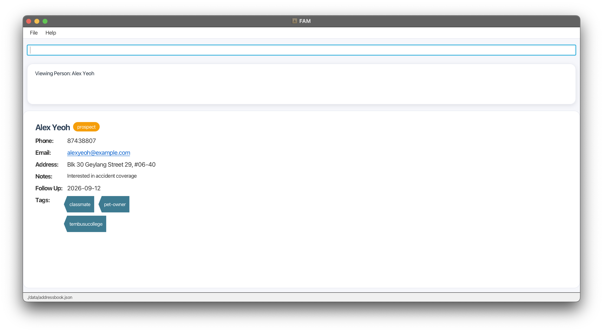

# Friends And Money (FAM)
Keeping in touch with your friends and clients should be **easy and efficient**.

FAM is a **desktop contact management app** built for student financial advisors. It helps you track your relationships,
log interactions, and schedule follow-ups in one place.

FAM is optimized for use via a **Command Line Interface (CLI)**. So, if you type fast, you can manage your contacts
**significantly faster** with FAM than with traditional apps.

A **Graphical User Interface (GUI)** is provided too, so that you can have the best of both worlds.

### Table of Contents
* [Quick Start](#quick-start)
* [Features](#features)
    * [Help](#viewing-help--help)
    * [Add](#adding-a-person-add)
    * [List](#listing-all-persons--list)
    * [Edit](#editing-a-person--edit)
    * [Find](#locating-persons-by-name-find)
    * [View](#viewing-a-person--view)
    * [View mode](#view-mode)
    * [Delete](#deleting-a-person--delete)
    * [Tag Add](#adding-a-tag--tagadd)
    * [Tag Remove](#removing-a-tag--tagrm)
    * [Note Add](#add-notes-to-a-person--note)
    * [Note Clear](#clear-a-persons-notes--noteclear)
    * [Circle Add](#add-a-circle-to-a-person--circleadd)
    * [Circle Remove](#remove-a-circle-from-a-person--circlerm)
    * [Circle Filter](#filter-for-a-circle--circlefilter)
    * [Follow-Up Date](#setting-follow-up-date--followup)
    * [Clear Follow-Up Date](#clearing-a-follow-up-date--followupclear)
    * [Remind](#listing-upcoming-follow-ups--remind)
    * [Clear](#clearing-all-entries--clear)
    * [Exit](#exiting-the-program--exit)
* [FAQ](#faq)
* [Known Issues](#known-issues)
* [Field Constraints Summary](#field-constraints-summary)
* [Command Summary](#command-summary)

--------------------------------------------------------------------------------------------------------------------

## Quick Start

1. Ensure you have Java `17` or above installed on your computer.
   **Mac users:** Ensure you have the precise JDK version prescribed [here](https://se-education.org/guides/tutorials/javaInstallationMac.html).

2. Download the latest `.jar` file from [here](https://github.com/AY2526S2-CS2103T-W12-4/tp/releases).

3. Copy the `.jar` file to a folder you would like to use as the _home folder_ to store your address book.

4. Open a command terminal, `cd` into the folder you put the `.jar` file in,
   and run `java -jar fam.jar` to run the application.
   A GUI similar to the one below should appear in a few seconds. Note that the app contains some sample data.
   .png)

5. Type a command in the command box and press Enter to execute it.
   Some example commands you can try:

    * `help` : Opens the help window.
    * `list` : Lists all contacts.
    * `add n/John Doe p/98765432 e/johnd@example.com a/John street, block 123, #01-01` :
      Adds a contact named `John Doe` to the address book.
    * `delete 3` : Deletes the 3rd contact shown in the current list.
    * `clear` : Deletes all contacts.
    * `exit` : Exits the app.

6. Refer to [Features](#features) for details of each command.

**Tip #1:** Read the [Command Summary](#command-summary) first for a quick overview of the available commands before 
proceeding to the detailed feature descriptions below.

**Tip #2:** Read the [Notes on Command Format](#features) before diving into individual features, it explains things 
like optional fields and command parameters that will make using the app much easier!

--------------------------------------------------------------------------------------------------------------------

## Features

**Notes about the command format**

* Words in `UPPER_CASE` are the parameters to be supplied by the user.
  e.g. in `add n/NAME`, `NAME` is a parameter, e.g. `add n/John Doe`.

* Items in square brackets are optional.
  e.g. `n/NAME [t/TAG]` can be used as `n/John Doe t/friend` or as `n/John Doe`.

* Items with `…` after them can be used multiple times, or zero times.
  e.g. `[t/TAG]…` can be omitted, or used as `t/friend`, `t/friend t/family`.

* Parameters can be in any order.
  e.g. `n/NAME p/PHONE_NUMBER` is the same as `p/PHONE_NUMBER n/NAME`.

* Extraneous parameters for commands that do not take in parameters (such as `help`, `list`, `exit`, and `clear`)
  will be ignored.
  e.g. `help 123` will be interpreted as `help`.

* For commands that require an `INDEX`, the index refers to the number shown beside the contact in the displayed list. The index must be a positive integer (e.g. `1, 2, 3, ...`) and be within the valid range of the current displayed list of contacts.

* In [View Mode](#view-mode), the index of the displayed contact is always `1`.

* If you are using a PDF version of this document, be careful when copying and pasting commands
  that span multiple lines, as space characters surrounding line breaks may be omitted when copied into the application.

### Viewing help : `help`

Shows a message explaining how to access the help page.

Format: `help`

### Adding a person: `add`

Adds a person to the address book.

* Minimum required fields: `n/NAME` and `p/PHONE_NUMBER`.
* Name must start with a letter or digit, contain at least one letter, and only consist of alphanumeric characters, spaces or the following symbols: `-`, `'`, `.`, `/`, `(`, `)`. It cannot be blank.
* Name does not have to be unique across contacts.
* Phone number must be numeric, have at least 3 and at most 17 digits and cannot be blank.
* Phone number and email must be unique across contacts. If a duplicate phone number or email is detected, the contact will not be added.
* Email, address, and tag are optional. These values can be updated after the contact is created using the `edit` command.
* Refer to [Field Constraints Summary](#field-constraints-summary) for a summary of the field constraints.

Format: `add n/NAME p/PHONE_NUMBER [e/EMAIL] [a/ADDRESS] [t/TAG]…`

Examples:
* `add n/John Doe p/98765432 e/johnd@example.com a/John street, block 123, #01-01`
* `add n/Betsy Crowe t/friend e/betsycrowe@example.com a/Newgate Prison p/1234567 t/criminal`

:information_source: **Note:** If prefixes are not typed correctly or separated by spaces, they may be read as part of the previous field.  
For example, `a/123 Streetp/91234567` may cause the phone number to be included in the address.  
To prevent this, ensure all prefixes are valid and separated by spaces.

### Listing all persons : `list`

Shows a list of all persons in the address book.

Format: `list`

### Editing a person : `edit`

Edits an existing person in the address book.

Format: `edit INDEX [n/NAME] [p/PHONE] [e/EMAIL] [a/ADDRESS] [t/TAG] [d/FOLLOWUPDATE] [c/CIRCLE]`

* Edits the person at the specified `INDEX`. The index refers to the index number shown in the displayed person list. 
* The index **must be a positive integer** `1, 2, 3, …`
* In [view mode](#view-mode), the index of the displayed contact is always `1`.
* At least one of the optional fields must be provided. 
* If no fields are modified, the command will be rejected.
* Existing values will be updated to the input values.
* Refer to [Field Constraints Summary](#field-constraints-summary) for a summary of the field constraints.
* After a successful edit, the app will return to the full contact list.

:information_source: **Note:** If prefixes are not typed correctly or separated by spaces, they may be read as part of the previous field.  
For example, `a/123 Streetp/91234567` may cause the phone number to be included in the address.  
To prevent this, ensure all prefixes are valid and separated by spaces.

#### Editing Tags

* You can remove all the person's tags by typing `t/` without specifying any tags after it.
* You can input multiple tags under the `edit` command. Each tag should have its own `t/` prefix.
* If you want to add or remove tags one at a time, use `tagadd` or `tagrm` instead.

**Warning:** Editing tags will replace **all** existing tags. Make sure to include all the tags you want the person to have 
when using `edit`. 
Example:
A contact initially has the tags `friend` and `colleague`. After you run `edit 1 t/friend t/cafe`, only the tags `friend` and `cafe` will be displayed.

Examples:
* `edit 1 p/91234567 e/johndoe@example.com c/friend` edits the phone number, email address, and circle of the 1st person to be `91234567`, `johndoe@example.com`, and `friend` respectively.
* `edit 2 n/Betsy Crower t/` edits the name of the 2nd person to be `Betsy Crower` and clears all existing tags.

### Locating persons by name: `find`

Finds persons whose names contain any of the given keywords.

Format: `find KEYWORD [MORE_KEYWORDS]`

* The search is case-insensitive. e.g. `hans` will match `Hans`
* The order of the keywords does not matter. e.g. `Hans Bo` will match `Bo Hans`
* Only the name is searched.
* Only full words will be matched. e.g. `Han` will not match `Hans`
* Persons matching at least one keyword will be returned (i.e. `OR` search).
  e.g. `Hans Bo` will return `Hans Gruber`, `Bo Yang`

Examples:
* `find John` returns `john` and `John Doe`
* `find david irfan` returns `David Li`, `Irfan Ibrahim`

### Viewing a person : `view`

Shows the specified person.

Format: `view INDEX`

* Shows the person at the specified `INDEX`.
* The index refers to the index number shown in the displayed person list.
* The index **must be a positive integer** `1, 2, 3, …`

Examples:
* `list` followed by `view 2` shows the 2nd person in the address book.
* `find Betsy` followed by `view 1` shows the 1st person in the results of the `find` command.

### View Mode

The screenshot below shows the app in View Mode.

After running `view`, the app enters **View Mode**, displaying the full details of the selected contact.

While in View Mode:
* The displayed contact is always shown at **index 1** in the list.
* Any command that takes an index (e.g. `edit`, `delete`, `note`) must use **index 1** to operate on the displayed contact.
* Commands that will exit View Mode: `add`, `delete`, `list`, `find`, `remind`, `clear`, `exit`.
* Run `list` to exit View Mode and return to the full contact list.

 :bulb: **Tip:** To view a different contact, run `list` first, then `view` on the desired index.

### Deleting a person : `delete`

Deletes the specified contact from the address book.

Format: `delete INDEX`

* Deletes the person at the specified `INDEX`.
* The index refers to the number shown beside your contact's name.
* The index **must be a positive integer** (e.g. `1, 2, 3, ...`) and be within the valid range of contacts.
* In [view mode](#view-mode), the index of the displayed contact is always `1`.
* A **confirmation message** will be shown before deletion. You will need to click `OK` to confirm the deletion.

Examples:
* `list` followed by `delete 2` deletes the 2nd person in the address book.
* `find Betsy` followed by `delete 1` deletes the 1st person in the results of the `find` command.

### Adding a tag : `tagadd`

Adds a tag to an existing person in the address book, one at a time.

Format: `tagadd INDEX t/TAG`

* Adds a tag to the person at the specified `INDEX`. The index refers to the index number shown in the displayed person list and **must be a positive integer** `1, 2, 3, …`
* In [view mode](#view-mode), the index of the displayed contact is always `1`.
* Only 1 tag can be added at a time. `t/tag t/tag2` will not work.
* Creates the tag if it does not already exist.
* For each contact, tag names must be unique and is case-insensitive (e.g. `t/camp` and `t/Camp` will be considered the same tag).
* A person can have a maximum of 5 tags. If the person already has 5 tags, any additional tag will not be added.

Examples:
* `tagadd 1 t/camp` adds the tag `camp` to the 1st person in the address book.

:bulb: **Tip:** Not sure when to use tags vs circles? See the [FAQ](#faq) for the difference.

### Removing a tag : `tagrm`

Removes a tag from an existing person in the address book, one at a time.

Format: `tagrm INDEX t/TAG`

* Removes a tag from the person at the specified `INDEX`. The index refers to the index number shown in the displayed person list. The index **must be a positive integer** `1, 2, 3, …`
* In [view mode](#view-mode), the index of the displayed contact is always `1`.
* Only 1 tag can be removed at a time. `t/tag t/tag2` will not work.
* Removes the tag if it exists for the person.
* If the tag does not exist, the deletion of the tag will not be allowed.

Examples:
* `tagrm 1 t/friend` removes the tag `friend` from the 1st person in the address book.

:bulb: **Tip:** To remove more than 1 tag at once, use `edit`.

### Add notes to a person : `note`

Adds a note to an existing person in the address book.

Format: `note INDEX note/NOTE`

* Adds a note to the person at the specified `INDEX`. The index refers to the index number shown in the displayed person list. The index **must be a positive integer** `1, 2, 3, …`
* In [view mode](#view-mode), the index of the displayed contact is always `1`.
* All text after `note/` will be treated as content for the note, including spaces and slashes.
* Blank notes (i.e. `note/` without any text after it) will not be added.
* Notes will only show up after running `view`.
* Each note entry and the total combined notes per person is limited to **1000 characters**. This is to ensure readability and prevent excessively long notes.

:information_source: **Note:** After adding the first note, subsequent notes will be appended with a pipe ` | `,
which also counts toward the 1000-character limit.

Examples:
* `note 1 note/Family of four, looking for family coverage` adds `Family of four, looking for family coverage` to the 1st person in the list.
* `note 2 note/A note/B note/C` adds `note/A note/B note/C` to the 2nd person in the list.

### Clear a person's notes : `noteclear`

Clears all notes of a person in the address book.

Format: `noteclear INDEX`

* Clears all notes of the person at the specified `INDEX`. The index refers to the index number shown in the displayed person list. The index **must be a positive integer** `1, 2, 3, …`
* In [view mode](#view-mode), the index of the displayed contact is always `1`.
* When `view`ing a person, their removed notes will no longer be shown.

Examples:
* `noteclear 1` clears all notes of the 1st person in the list.

### Add a circle to a person : `circleadd`

Adds a circle to an existing person in the address book.
A circle refers to the type of relationship the user has with the contact.

Format: `circleadd INDEX c/CIRCLE`

* The circle will be added to the person at the specified `INDEX`. The index refers to the index number shown in the displayed person list. The index **must be a positive integer** `1, 2, 3, …`
* There are only 3 types of circles: `client`, `prospect`, and `friend`. The circle must be one of these 3 types. Any other value given to `circleadd` will be rejected.
* In [view mode](#view-mode), the index of the displayed contact is always `1`.
* Only 1 circle can be added at a time to 1 contact.
* If the person already has a circle, the addition of the circle will not be allowed.
* Note: A circle can only be added via the `circleadd` and `edit` commands, but not the `add` command.

Examples:
* `circleadd 1 c/client` adds the circle `client` to the 1st person in the address book.
* `circleadd 2 c/prospect` adds the circle `prospect` to the 2nd person in the address book.
* `circleadd 3 c/family` will lead to an error message as `family` is not an accepted circle type.

:bulb: **Tip:** Not sure when to use tags vs circles? See the [FAQ](#faq) for the difference.

### Remove a circle from a person : `circlerm`

Removes a circle from an existing person in the address book.
A circle refers to the type of relationship the user has with the contact.

Format: `circlerm INDEX`

* The circle will be removed from the person at the specified `INDEX`. The index refers to the index number shown in 
the displayed person list. The index **must be a positive integer** `1, 2, 3, …`
* In [view mode](#view-mode), the index of the displayed contact is always `1`.
* Only 1 circle can be removed at a time from 1 contact.
* If the person does not have a circle, the deletion of the circle will not be allowed.
* To edit an existing circle, you will need to first remove the existing circle using the `circlerm` command, and then 
add the new circle using the `circleadd` command.

Examples:
* `circlerm 1` removes the circle from the 1st person in the address book, regardless of the circle.

### Filter for a circle : `circlefilter`

Filters and shows all contacts in the address book with the specified circle.
A circle refers to the type of relationship the user has with the contact.

Format: `circlefilter CIRCLE`

* All contacts with the specified circle will be shown in their index order in the address book.
* There are only 3 types of circles: `client`, `prospect`, and `friend`. The circle must be one of these 3 types. 
Any other value given to `circlefilter` will be rejected.
* Note: Circles can only be filtered via the `circlefilter` command.

**Tip:** To return to the original view, simply type `list`.

Examples:
* `circlefilter client` shows all contacts with the circle `client` in the address book, in their index order in the 
address book.
* `circlefilter family` will lead to an error message as `family` is not an accepted circle type.

### Setting follow-up date : `followup`

Sets or updates the follow-up date for a contact.

Format: `followup INDEX d/DATE`

* Sets the follow-up date for the contact at the specified `INDEX`. The index refers to the index number shown in the 
displayed person list. The index **must be a positive integer** `1, 2, 3, …`
* In [view mode](#view-mode), the index of the displayed contact is always `1`.
* `DATE` must be in the format `YYYY-MM-DD` (e.g. `2026-04-01`).
* Past dates are allowed, but the app will show a warning after the date is set.
* Dates more than 5 years from today are allowed, but the app will show a warning after the date is set.
* Dates in the next 3 days will be <u>**underlined and bolded**</u> to as a visual reminder. 
If a date has passed, its formatting will be updated when the app is restarted. 
* Note: A follow-up date can only be added via the `followup` and `edit` commands, but not the `add` command.

Examples:
* `followup 1 d/2026-04-01` sets the follow-up date of contact 1 to `2026-04-01`.
* `followup 2 d/2020-01-01` sets the follow-up date of contact 2 to `2020-01-01` and shows a warning because the 
date is before today.
* `followup 3 d/26-03-2026` will lead to an error message because the date format is invalid.

### Clearing a follow-up date : `followupclear`

Clears the follow-up date of a contact.

Format: `followupclear INDEX`

* Clears the follow-up date of the contact at the specified `INDEX`.
* The index refers to the index number shown in the displayed person list.
* The index **must be a positive integer** `1, 2, 3, …`
* In [view mode](#view-mode), the index of the displayed contact is always `1`.
* Note: A follow-up date can only be removed via the `followupclear` command.

Examples:
* `followupclear 1` clears the follow-up date of the 1st contact in the list.

### Listing upcoming follow-ups : `remind`

Lists all contacts whose follow-up dates fall within the next specified number of days, inclusive of today.

Format: `remind DAYS`

* Shows contacts with follow-up dates from today up to `DAYS` days ahead.
* `DAYS` **must be a positive integer**.
* Contacts without a follow-up date will not be shown.

Examples:
* `remind 1` lists all contacts with follow-up dates today or tomorrow.
* `remind 3` lists all contacts with follow-up dates within the next 3 days.
* `remind 7` lists all contacts with follow-up dates within the next 7 days.

**Tip:** To return to the original view, simply type `list`.

### Clearing all entries : `clear`

Clears all entries from the address book.

Format: `clear`

### Exiting the program : `exit`

Exits the program.

Format: `exit`

### Saving the data

FAM conveniently auto-saves your data after every command, so you never have to worry about saving manually.

If you wish to view or edit your data, you can access the file at:  
`[JAR file location]/data/addressbook.json`

### Editing the data file

FAM's data is saved automatically as a JSON file at: 
`[JAR file location]/data/addressbook.json`  Advanced users are 
welcome to update data directly by editing that data file.

**Caution:** If the file format is invalid, or if any fields contain values in an invalid format, FAM will load with an 
empty address book on the next startup. The UI will display:
`Data file could not be loaded. Starting with empty address book.`

:warning: Warning: Although the storage file can still be manually corrected to a valid format, **running any command 
while FAM is in this empty state will overwrite the file and permanently erase all existing data.**

It is strongly recommended to back up the data file before making any changes, and to avoid executing any commands 
until the file has been fixed.

--------------------------------------------------------------------------------------------------------------------

## FAQ

**Q**: How do I transfer my data to another computer?  
**A**: Install FAM on the other computer. Overwrite the empty data file that it creates with the file from your previous FAM home folder that contains your data.

**Q**: Can I add a circle or follow-up date when using `add`?  
**A**: No. `add` only creates the contact. To add a circle or follow-up date, use `circleadd`, `followup`, or `edit` afterward.

**Q**: Does `edit` add tags to the contact’s existing tags?  
**A**: No. Using `edit` with `t/` replaces the contact’s entire tag list with the new tags provided. Use `tagadd` or `tagrm` to modify tags one at a time.

**Q**: How do I remove all tags from a contact?  
**A**: Use `edit INDEX t/` to clear all tags for that contact.

**Q**: Why do I have to use index `1` after `view`?  
**A**: In View Mode, only the selected contact is shown, so commands that require an index must use `1`.

**Q**: Why is a contact not shown in `remind`?  
**A**: Only contacts with a follow-up date are shown by `remind`.

**Q**: What's the difference between `tag` and `circle`?  
**A**: Tag is meant to be a flexible label that you can create and use as you wish to make each contact differentiable, while circle is meant to be a single label that indicates the type of relationship you, as a FA, have with the contact. A contact can have multiple tags but only one circle.

**Q**: Can I undo a `delete` or `clear` command?  
**A**: No. There is currently no undo feature, so users should confirm carefully before deleting data.

--------------------------------------------------------------------------------------------------------------------

## Known Issues

1. **When using multiple screens**, if you move the application to a secondary screen and later switch to using only the 
primary screen, the GUI may open off-screen. The remedy is to delete the `preferences.json` file created by the 
application before running the application again.
2. **If you minimize the Help Window** and then run the `help` command again (or use the `Help` menu, or the keyboard 
shortcut `F1`), the original Help Window will remain minimized, and no new Help Window will appear. The remedy is to manually restore the minimized Help Window.
3. **Reserved internal values cannot be used as input**: The values `missing@email.empty` (as an email) and `MISSING_ADDRESS` (as an address) are reserved for FAM's internal use and will be rejected with an error if entered. Use a different email or address value instead.

--------------------------------------------------------------------------------------------------------------------
## Field Constraints Summary

| Field | Required | Format / Value                                                                                                                                                             | Unique* | Modifiable | Removable | Notes                                                                               |
|------|----------|----------------------------------------------------------------------------------------------------------------------------------------------------------------------------|---------|------------|------------|-------------------------------------------------------------------------------------|
| **Name** | Yes | Must start with a letter or digit, contain at least one letter, and only consist of alphanumeric characters, spaces or the following symbols: `-`, `'`, `.`, `/`, `(`, `)` | No      | Yes | No | Can be duplicated across contacts                                                   |
| **Phone Number** | Yes | Numbers only, at least 3 and at most 17 digits                                                                                                                             | Yes     | Yes | No | Each contact can have only one phone number                                         |
| **Email** | No | Valid email format                                                                                                                                                         | Yes     | Yes | No | Optional when adding, but cannot be removed once added                              |
| **Address** | No | Accepts any value                                                                                                                                                          | No      | Yes | No | Optional when adding, but cannot be removed once added                              |
| **Circle** | No | Must be `client`, `prospect`, or `friend`                                                                                                                                  | No      | Yes | Yes | Each contact can only have one circle.                                              |
| **Note** | No | Accepts any value, max 1000 characters total                                                                                                                               | No      | Yes | Yes | Can only be added via `note` and removed via `noteclear`, visible only in View Mode |
| **Follow-up Date** | No | Format: `YYYY-MM-DD`, must be a valid calendar date                                                                                                                        | No      | Yes | Yes | Warning shown if date is in the past                                                |
| **Tag** | No | 1–20 characters per tag, alphanumeric or hyphens only, no spaces, case-insensitive                                                                                         | No      | Yes | Yes | Max 5 tags per contact, tag cannot be duplicated for the same contact               |

*Note: Unique means the value cannot be duplicated across different contacts.

## Command Summary

Action | Format, Examples
--------|------------------
**Add** |`add n/NAME p/PHONE_NUMBER [e/EMAIL] [a/ADDRESS] [t/TAG]…`   e.g. `add n/James Ho p/22224444 e/jamesho@example.com a/123, Clementi Rd, 1234665 t/friend t/colleague`
**Clear** | `clear`
**Delete** | `delete INDEX`   e.g. `delete 3`
**Edit** | `edit INDEX [n/NAME] [p/PHONE_NUMBER] [e/EMAIL] [a/ADDRESS] [t/TAG]…`   e.g. `edit 2 n/James Lee e/jameslee@example.com`
**Find** | `find KEYWORD [MORE_KEYWORDS]`   e.g. `find James Jake`
**List** | `list`
**Help** | `help`
**View** | `view INDEX`   e.g. `view 3`
**Tag Add** | `tagadd INDEX t/TAG`   e.g. `tagadd 1 t/friend`
**Tag Remove** | `tagrm INDEX t/TAG`   e.g. `tagrm 1 t/friend`
**Note Add** | `note INDEX note/NOTE`   e.g. `note 1 note/looking for student coverage`
**Note Clear** | `noteclear INDEX`   e.g. `noteclear 1`
**Circle Add** | `circleadd INDEX c/CIRCLE`   e.g. `circleadd 1 c/client`
**Circle Remove** | `circlerm INDEX`   e.g. `circlerm 1`
**Circle Filter** | `circlefilter CIRCLE`   e.g. `circlefilter client`
**Follow Up** | `followup INDEX d/DATE`   e.g. `followup 1 d/2026-04-01`
**Follow Up Clear** | `followupclear INDEX`   e.g. `followupclear 1`
**Remind** | `remind DAYS`   e.g. `remind 3`
**Exit** | `exit`
